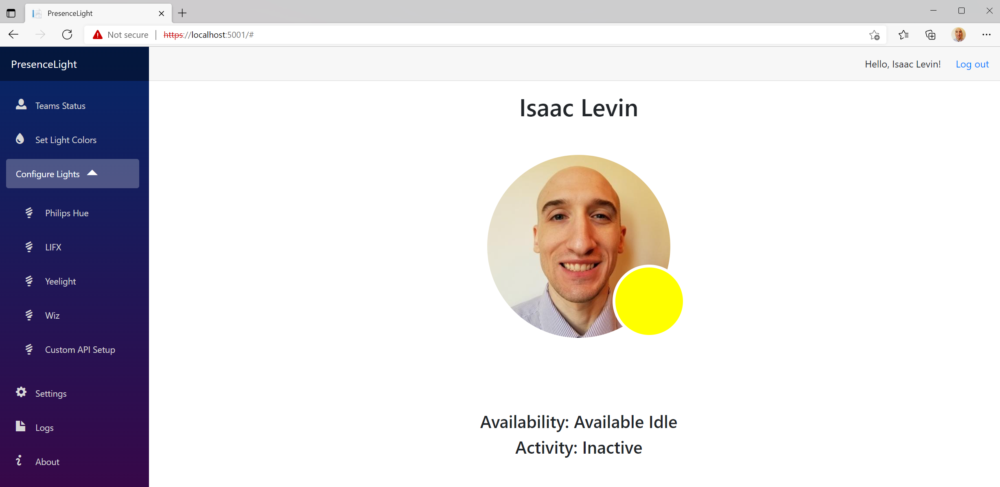

# PresenceLight

### Worker Version Installs
http://presencelightapp.azurewebsites.net/

### App Setup
The cross platform version of PresenceLight runs as a .NET Core 5 single file executable application that runs a Server-Side Blazor Web Application and a ASP.NET Core Worker Service. The Blazor App is used as the mechanism to log the user in and configure settings of the app, while the Worker Service is responsible for interaction with Graph Api as well as the Smart Lights. This allows users to not need to have a UI version of the app open at all time, since the worker runs as a process. There is no installer for PresenceLight, so all that needs to be done is to download the zip folder from the [install site](http://presencelightapp.azurewebsites.net/), unzip, and run the .exe. At this point, a terminal window will open showing 

 

Here you will the Url for the Kestrel hosted Web Application. Going to that Url will take you to web app, and will force a login to Azure Active Directory (for the Graph call). After login, you will see a similar look and feel to the client app.

 
 
 From here you can use PresenceLight in a similar way to the client app. You can enable and operate lights, push custom lights and configure polling. When done, you can close the browser and PresenceLight will continue to run in the background.
 
 To make the process even cleaner, you can configure a startup task to run the exe at startup, and PresenceLight will be available at the url listed the first time you ran it.

### Running on a Remote Machine
TBD

### Third Party Libraries

PresenceLight would not be possible without the amazing work from the contributors to the following third party libraries!

- [Blazored.Modal](https://github.com/Blazored/Modal)
- [Blazorise](https://github.com/stsrki/Blazorise)
- [IdentityModel.OidcClient](https://github.com/IdentityModel/IdentityModel.OidcClient)
- [Newtonsoft.Json](https://github.com/JamesNK/Newtonsoft.Json)
